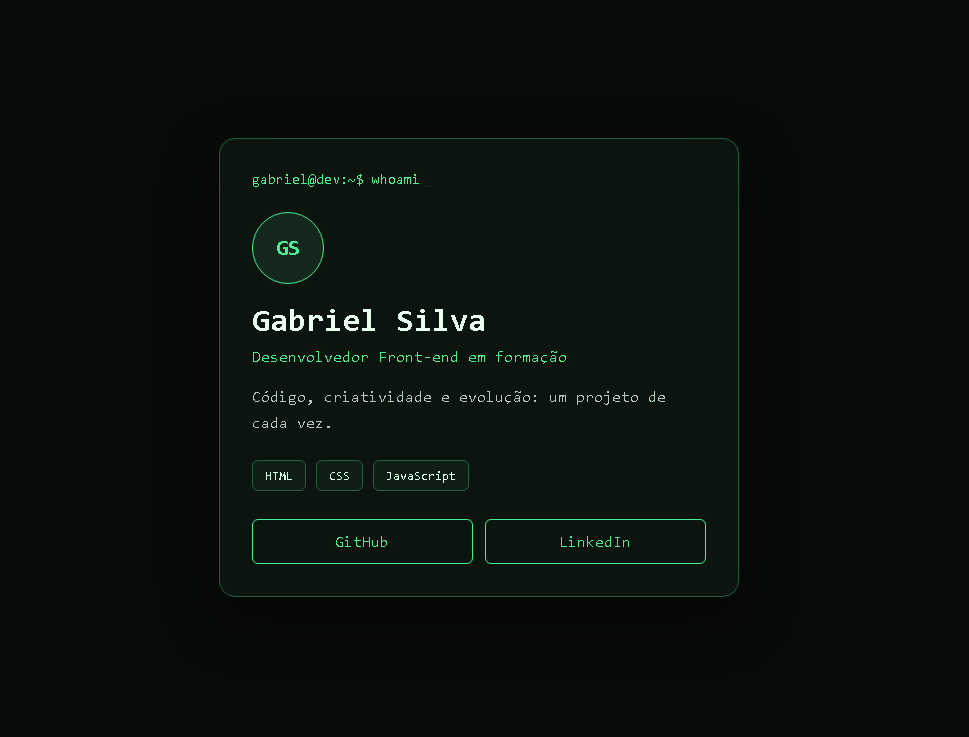

# DevCard

Meu primeiro cartão profissional desenvolvido com HTML, CSS e JavaScript.

O projeto apresenta minhas informações, tecnologias que estou estudando e links para meus perfis profissionais.

## Tecnologias utilizadas

- HTML
- CSS
- JavaScript

## O que pratiquei

- Estruturação de conteúdo com HTML
- Estilização e organização com CSS
- Responsividade para dispositivos móveis
- Animação de texto com JavaScript
- Utilização do Live Server no VS Code

## Como executar

1. Baixe ou clone este repositório.
2. Abra a pasta no VS Code.
3. Abra o arquivo `index.html` com o Live Server.

## Autor

Gabriel Silva

- GitHub: [gabrielsilva-dsd](https://github.com/gabrielsilva-dsd)